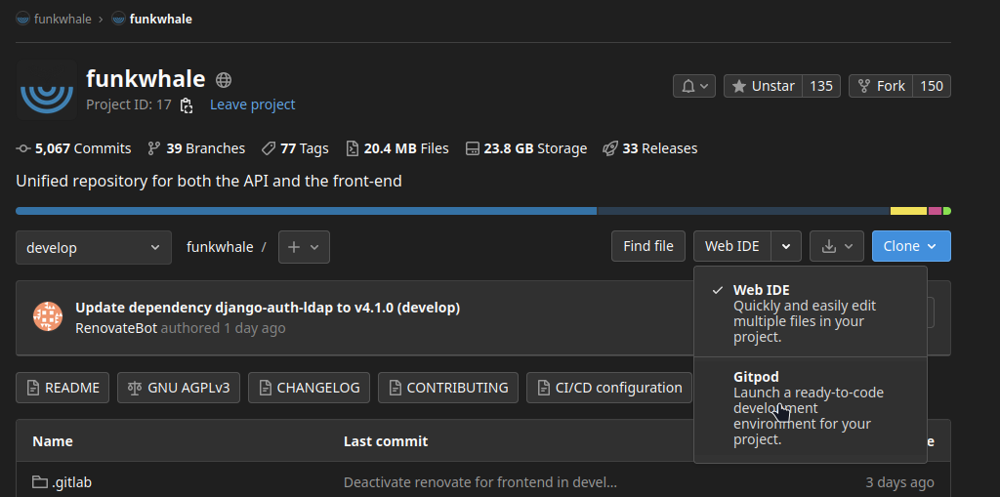

# Develop using Gitpod

```{note}
You need a GitHub or GitLab.com account to log in to Gitpod.
```

Funkwhale has a Gitpod instance that gives you all the tools you need to work on Funkwhale's code. You can work on the code in-browser using a hosted VS Code install or open VS Code on your desktop over SSH.

You can open Gitpod directly by clicking the link below. This checks out the `develop` branch for you to work on directly.

[](https://gitpod.io/#https://dev.funkwhale.audio/funkwhale/funkwhale)

If you want to work on a particular branch, commit, or merge request, you can do this straight from the GitLab interface. Select the arrow icon on the {guilabel}`Web IDE` button and select {guilabel}`Gitpod` to open Gitpod with the currently selected branch checked out.



When you start Gitpod, it creates the following using the selected branch:

- A Funkwhale API instance
- A Funkwhale frontend instance

You can access the web app at `http://localhost:8000`. Log in with the following credentials:

- Username – `gitpod`
- Password – `gitpod`

## Work on the frontend

By default, Gitpod spins up an entire Funkwhale stack. If you want to work only on the frontend:

1. Select `File` > `Open Folder`
2. Select `/workspace/funkwhale/front`

Gitpod starts a new Vite server on port 4000. This creates a frontend that isn't connected to any instance.

## GitLab Workflow extension

Gitpod offers a GitLab workflow extension to help manage GitLab issues, merge requests, and pipelines. If you want to use it:

1. Navigate to the personal access token section of your [GitLab profile settings](https://dev.funkwhale.audio/-/profile/personal_access_tokens)
2. Create a personal access token with `api` and `read_user` scopes
3. Paste your token into your [Gitpod variables](https://gitpod.io/variables)

Use the following settings to automatically sign in to the extension with Gitpod. The `funkwhale/*` scope ensures you can use the settings for all Funkwhale-hosted projects.

```{list-table} Environment variables
:header-rows: 1

   * - Name
     - Value
     - Scope
   * - `GITLAB_WORKFLOW_INSTANCE_URL`
     - `https://dev.funkwhale.audio`
     - `funkwhale/*`
   * - `GITLAB_WORKFLOW_TOKEN`
     - Your token
     - `funkwhale/*`
```

## Configure custom instance URL

You can configure Gitpod to use your Funkwhale pod as the default server. This means you can test frontend changes on your pod without selecting it each time. To do this, add the following to your [Gitpod variables](https://gitpod.io/variables):

```{list-table} Environment variables
   :header-rows: 1

   * - Name
     - Value
     - Scope
   * - `VUE_APP_INSTANCE_URL`
     - `https://funkwhale.example.com`
     - `funkwhale/funkwhale`
```
